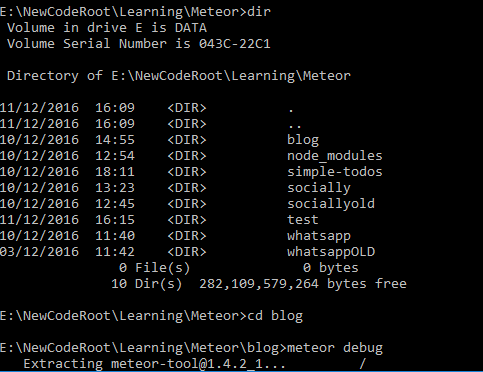

Meteor has been a struggle for many, including myself. While I enjoy the framework and it seems like a good way to make web apps quickly and have them look and respond well, for many windows users the truth of the matter is that meteor doesn't work well.
Meteor restarting itself whenever you change files, and refreshing the page is really a great boon to productivity, as it allows you to keep on coding and not have to think about restarting the framework whenever you want to test something.

My biggest issue so far has been an insane amount of time taken to get meteor to start. While this is a common issue amongst meteor users, for myself it takes forever, but only on my laptop. On my desktop it will start nearly instantly. It would tend to hang on "Extracting Meteor Tools".
I eventually found out that the issue was *probably* because I had the audacity to have 7-zip installed on my system, and uninstalling it fixed my issues. Mostly. There was some other odd issues still which I was able to fix by deleting some magic file which was breaking meteor for no apparent reason.
Additionally, in my struggle to get meteor working somewhere, I came to the realization that it doesn't seem to work on windows bash subsystem, which was fun.

Other issues I've had with meteor so far have been attempting to really wrap my head around how the system works. Just when I think I figured out how meteor works, I am presented with more material that hazes my view of how it all functions as a whole. I'm gradually getting there, but I have a lot of questions still. All the puzzle pieces are there, but I'm working on fitting them all together.
This isn't really a problem that's easy to fix, it just comes with being more comfortable with the framework and being able to really understand the processes at hand. For example, I understand the concept behind the subscriptions in meteor, and how by doing that you control what content goes where, but I don't really understandhow it works, or why I'd need it. There are many things I just need to become more comfortable with.

That being said, I like meteor, despite what it has put me through. I like the approach to web development, and I like how powerful it is. I just wish it was faster too.

