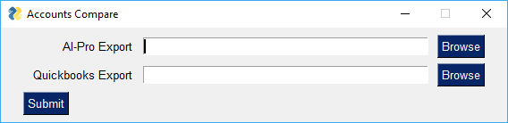
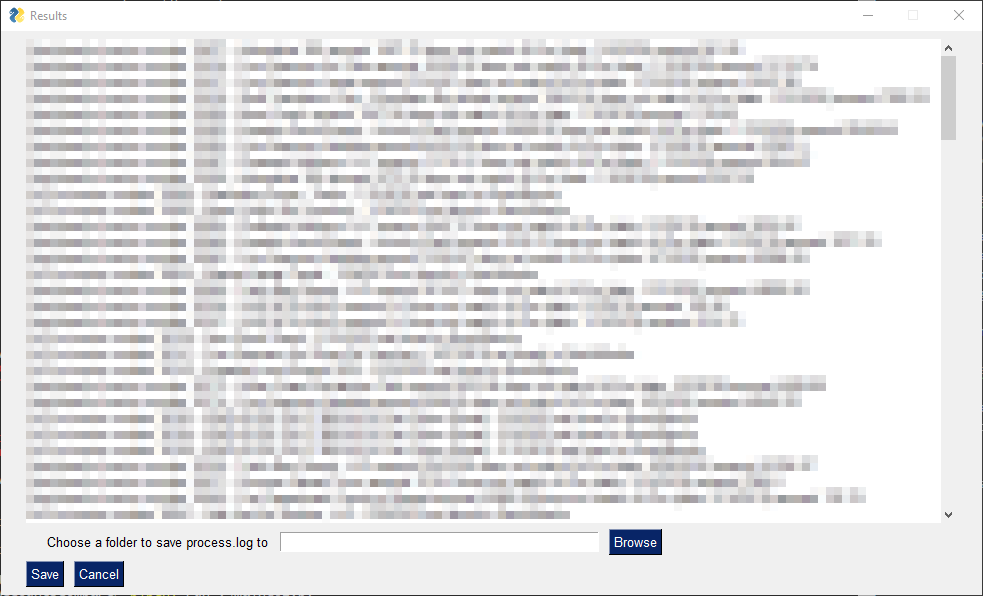

My parents run a business and my mother approached me with a task: make an application for her to speed up a very repetative reconciliation process.

It took me a good deal of time, but at the end I came up with something I was very happy with.

Here is the interface you are first greeted with:

this first interface you use to select the two data sources. One is a CSV exported by "AL-Pro" a reservation and payment tracking software designed for tour companies.

The other source of data is a .xlsx document from quickbooks.

The program will compare the invoice numbers in both data sources and compare to see the following:

1. The AL-Pro record exists in Quickbooks
1. The amount paid is the same in both.

Then, the application shows a list of results as follows (financial information redacted):

For this I used the following:

1. PySimpleGUI
1. OpenPyXL

PySimpleGUI is a little too simple at times, but it worked for my needs, as I only had those two screens and a couple of error screens.

I also used the logging module in python for the first time with this project, and use it to make a log file. I really like the logging module in python, and I wish I knew to use it earlier.
