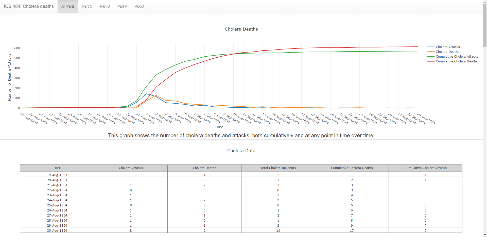
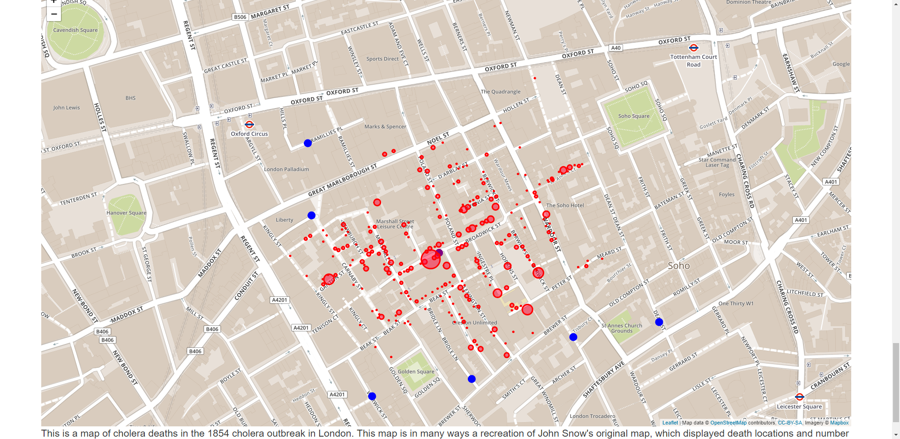

I made this for a class project for data visualization. It was a month long project using <a href="https://plot.ly/">Plot.ly</a> for making the graphs and tables, and <a href="https://leafletjs.com">leafletjs</a> for our map.

This is the first chart and table, both made with Plotly. Plotly allows for simple creation of graphs, but it has it's drawbacks, as it doesn't scale well when the page is resized, and it doesn't play well on mobile screens, limiting its usefulness. It is still a powerful tool for quickly making graphs.

I made the title bar with Bootstrap, which I've grown to enjoy.

Here is the map I made with leafletjs. Leaflet I had no real issues with, as it lets you make a map, and you can do almost anything with it, here I added circles that can be clicked on on top of the map.

<a href="../cholera/">You can access the site here</a>