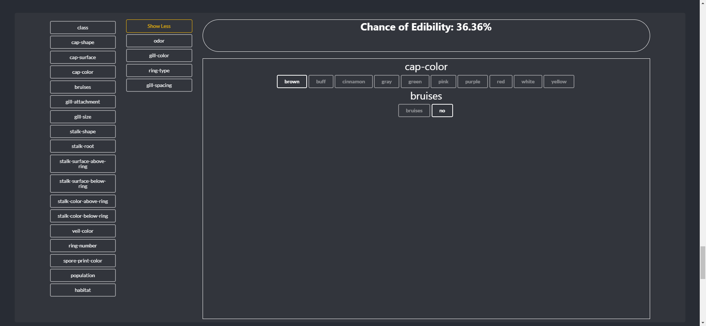
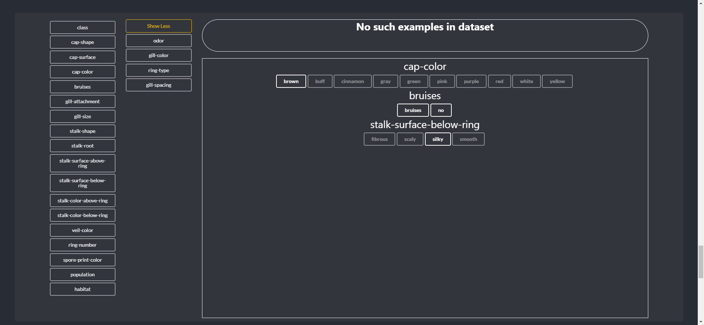
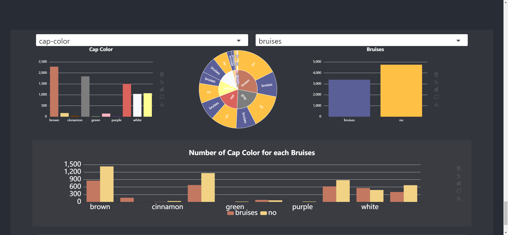
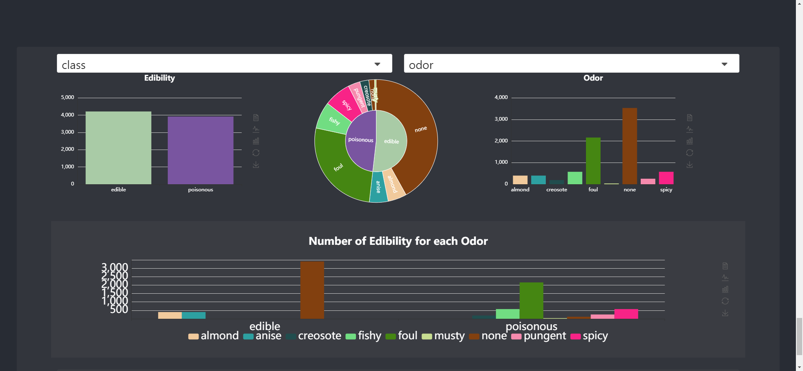

# Mushrooms

This was made for a group final project for our data visualization class at UH Manoa.
Me and three other people worked on this over the course of a week or two, and we had one of the better visualizations in the class.

My work was primarily in the two charts at the end, the calculator and the comparison tool.

I also worked on the data cleaning to get it into a more usable form

Our data was given to us as a CSV we found online originally intended to be used for machine learning exercises. <https://archive.ics.uci.edu/ml/datasets/mushroom>

To make it easier to use with react.js I first converted the data into a .json and expanded it from being single characters to words.
This made the data much bigger, but it did not end up having a significant impact on the performance of the site, and made it far easier to work with, as you can simply import the json with react, and webpack will insert it into the final documents.

You can see it <a href="extrathick.github.io">here</a>

## Calculator

The calculator was the biggest challenge for me in this assignment. The data we have is rather unnatural in how it's laid out. There are some attributes which "exist" in the dataset but in reality aren't present.
This led to the case where when calculating the edibility of the traits selected we had to say that there was "no data found", as I couldn't think of a way to make any suggestions to the edibility of the chosen things without distorting what the data actually said greatly.

the calculator working

The calculator when it has no data

## Sunburst

The sunburst was the most fun for this project. It took some time to figure out how to go through and process all the data beforehand, but the end product was something really nice.
The great advantage of using react here is the ability to make something like this.
Initially I made something similar without the bar charts to the side and that was something I could do because of React's statefulness.
I could have the two selection boxes be the state of the application and when the state changed, I could recalculate the necessary data.
The actual calculation method seems like it would have taken a long time, but I guess thanks to modern systems the amount of calculation I needed to do wasn't a problem.
I needed to match all things from one category that also had another category so this took a while to do.

This is something I built early on into the project and it actually helped the project out quite a bit.
We ended up being able to use it to get more insight into the nature of the data and how it all looked, which enabled us to make charts intelligently on the data.

This is an example of another setting for the sunburst chart which shows the usefulness of the chart and additionally some of the issues with the data, where there are barely any examples with certain attributes, and some ones have 0 in the dataset.

Overall the website was quire good, the only remaining issues which we didn't fix was the mobile layout, which is extremely bad, something we didn't expect when using react.js