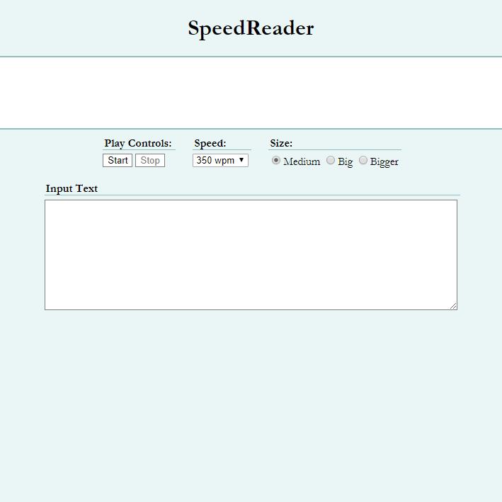

  

Speedreader is a simple web app I made for UW CSE 154. We were required to make a speed reading app. It has three settings for word size, and a few settings for speed. It is built in Vanilla JavaScript, CSS3, and HTML5. It passes use-strict mode.

I made this over the course of a week, and it taught me a good deal about javascript and JS timers.

It's also fairly useful which is why I like it. It's a real speedreading application that works.

You can see the project at [this site](/speedreader/speedreader.html).
