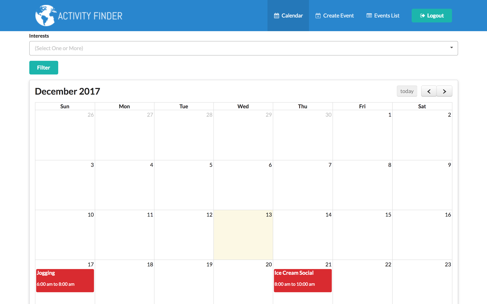
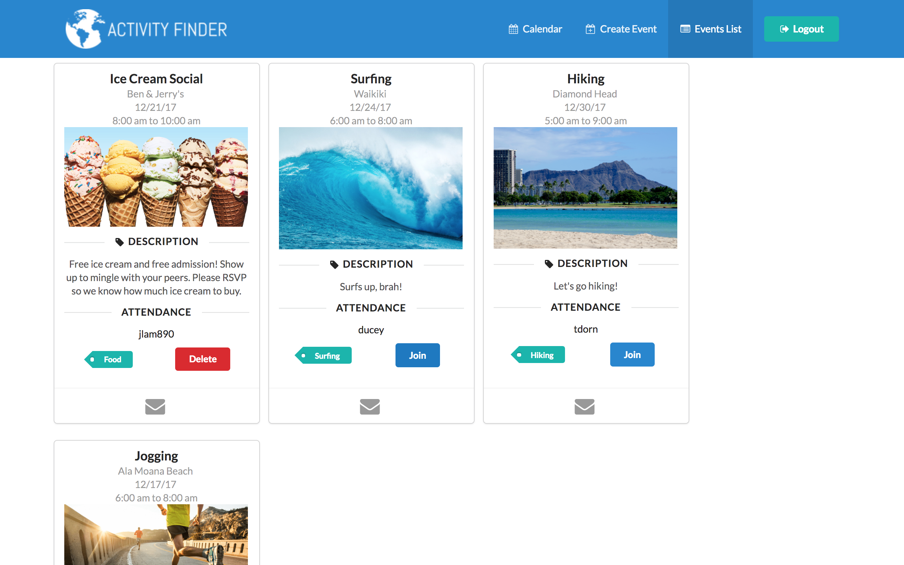
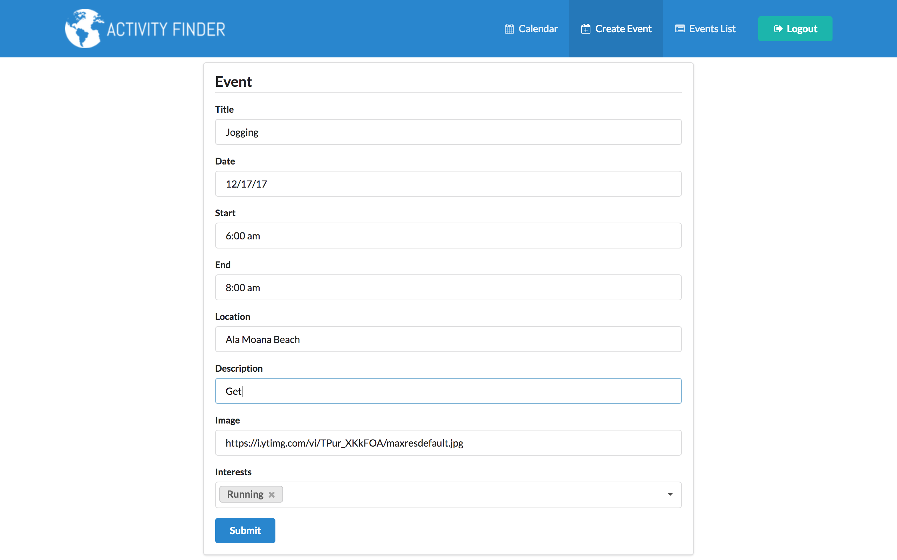

Activity Finder is a web application made in Meteor. It allows you to create and view events. It is limited to UH Manoa students, as it requires a UH login to access. It has three pages.

A calendar, which displays all events in the system. If you are in the event, the item shows up as red on the calendar, if you aren't it is blue. If you click on the events, it takes you to the event list page for more info.

A list of all events where you can email the creator, or join the event. If you are the owner of the event you can delete the event. You can see the description, location, and associated image for the event on this page.

There is also a page to create an event, which only requires the top four fields.

The project was a fun learning experience for me and my teammates. I think that our final project, while it has it's shortcomings, is pretty usable. some of the negative points of our project is the inability to edit the events, and that usernames are not abstracted away from the user, as the name you see is the UH ID of the people.

That being said, I am proud of the work me and my group did, and I think I have learned much in this class, although there is more to learn.

More info: <a href="activityfinder.github.io">activityfinder.github.io</a>

GitHub link: <a href="https://github.com/activityfinder/activityfinder">Activity Finder</a>
