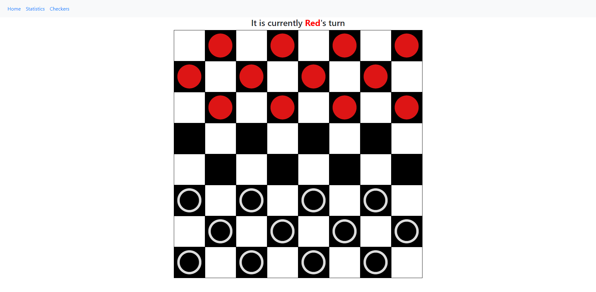
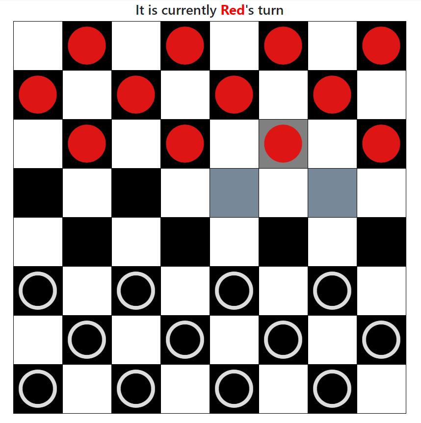

Open Table Checkers is a web app for a game of checkers that anyone can play, and jump in. There are no accounts or profiles, and only one consistent game.

It is written in Flask, which is a nice lightweight framework for building web apps. Python is an enjoyable language for designing server behavior, because of the ease of adding new features.

Here is the game, it works as intended mostly save for one bug I can't pin down. I had some issue making the server easy to run, so I had to set up a few batch files for windows use. Red goes first, and can move one piece at a time. The game _mostly_ follows standard checkers rules, save for forcing a jump if a jump is possible. Kinging is possible.

The game shows you where a given piece can move by changing the color of the tiles in question. You control the game by clicking on a piece (whose turn it is) and then clicking on another tile.

I learned a lot about organizing my code during this project. Even though I had thought about the layout of my project, when it came time to add more, it became very difficult, due to not picking better ways. For instance, I hadn't made a wrapper function for interacting with the database, and when I migrated my database from Oracle to SQLite, I needed to go through and change much of my code.

<a href="https://github.com/tylergdorn/ICS321">You can find the project here</a>